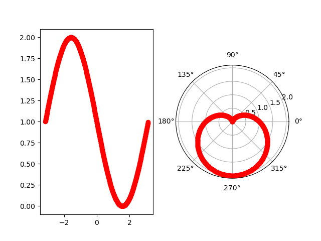

# 求心型曲线的面积
- $ r=a*(1-sin\theta) $
  
## 绘制函数图像(分别在直角和极坐标系中)

- 
  
## 思考

- 两种坐标系是啥关系 ，没有百度，考虑背后的本质。初步认为相同的函数，只是表现形式不同而已
  
- 在极坐标系中，是闭合曲线围成的面积，考虑实质上对应在直角坐标系中，也应该是曲线本身围成图像的的面积

- 在直角坐标系中，观察图像明显具有对称性，如果将其中的一半对着，看上去应该像是个椭圆形，那么极坐标中的心型，就是直角坐标系中的椭圆形

- 变成成求半个椭圆形的面积
  
## 求解

- $ 2*A*\int _0 ^ \pi -sin(\theta) $